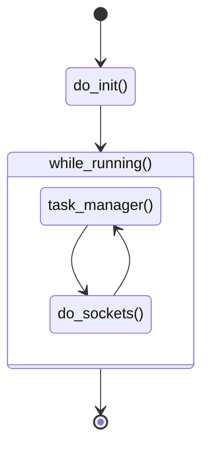
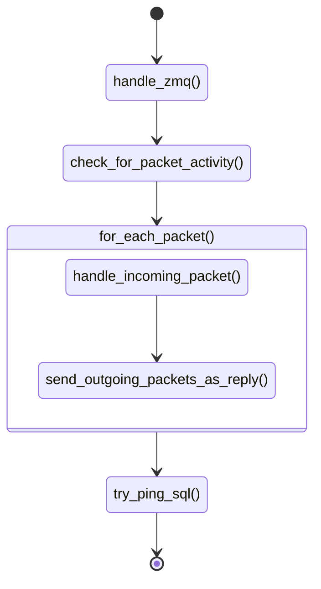
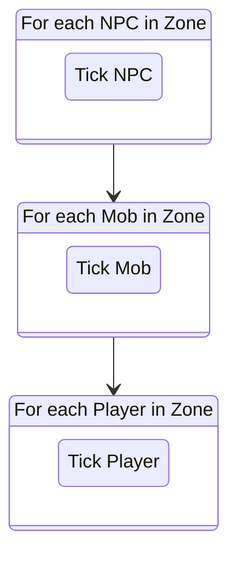
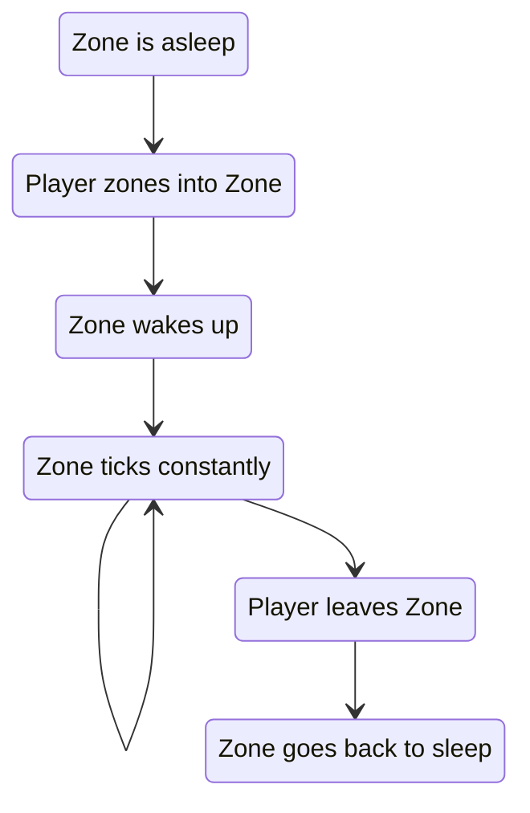

# Server Startup Tutorial

**NOTE:** In order to give a somewhat simple high-level overview of how the server starts up and runs, a lot of pseudocode and diagrams are used. These do not necessarily reflect actual code in the repo!

_This only covers `xi_map` server and not the others!_

## Server entry point

`src/common/kernel.cpp` calling functions defined in `src/map/map.cpp`

### PSEUDOCODE

```cpp
    // Loads EVERYTHING (settings, Lua, database, etc.)
    do_init(...);

    while (running)
    {
        // Work on Task Manager tasks until its time to do socket stuff again
        CTaskMgr::getInstance()->DoTimer(server_clock::now());

        // socket stuff
        do_sockets(...);
    }
```



## "Socket stuff"

### PSEUDOCODE

`src/map/map.cpp` -> `do_sockets`:

```cpp
    // Listen for ZMQ messages (inter-process messages)
    message::handle_incoming();

    // Listen for packets from connected clients
    check_for_packet_activity()
    if (packets)
    {
        for (packet : packets)
        {
            handle_incoming_packet(packet)
            send_outgoing_packets_as_reply()
        }
    }

    // Make sure connection to database is still there
    sql->TryPing();
```



## Handling Incoming Packets

`src/map/map.cpp`

Once we have recieved a buffer full of data from a connected client, we use their connection details and their sent data to look up their session. We validate all of this data (somewhat) and pass it into the relevant `Packet Handler` for their packet.

`src/map/packet_system.cpp`

`PacketParser[SmallPD_Type](map_session_data, PChar, CBasicPacket(reinterpret_cast<uint8*>(SmallPD_ptr)));`

There is one `Packet Handler` for each packet type sent from the client. We typically extract data from the packet, validate it (somewhat), and then use that data to do the things the client is requesting (`Player Action` below).

### PSEUDOCODE

```cpp
// Player Action Packet 0x01A
void SmallPacket0x01A(map_session_data_t* const PSession, CCharEntity* const PChar, CBasicPacket data)
{
    uint16 TargID = data.ref<uint16>(0x08);
    uint8  action = data.ref<uint8>(0x0A);
    ...
```

## Task Manager Tasks

These are set up during the server's `do_init` in `src/map/map.cpp`:

### PSEUDOCODE

```cpp
    // Handle all logic related to time, onGameHour, Conquest, etc. every 2.4s
    // NOTE: This is not in-game Combat ticks, status ticks, etc.
    CTaskManager->AddTask("time_server", time_server, 2400ms);

    // Clean up after any players or other entities who no longer exist in zones, every 5s.
    CTaskManager->AddTask("map_cleanup", map_cleanup, 5s);

    // Run Lua garbage collection. This isn't automatic, so we do it by hand every 15 mins.
    CTaskManager->AddTask("garbage_collect", map_garbage_collect, 15min);

    // We cache a lot of non-critical free-form data about characters in memory for performance, try to flush this info
    // every 1min.
    CTaskManager->AddTask("persist_server_vars", serverutils::PersistVolatileServerVars, 1min);
```

## Where's the player logic?

Zones handle all of the entity logic in the form:



On startup, all zones are inactive in order to avoid doing more work than necessary. A zone only "wakes up" once a player zones in to it. This involves multiple packets sent from the client and handled in the relevant `Packet Handlers`.

Once a Zone wakes up it registers a `Task Manager` job which will repeatedly call
`PZone->ZoneServer(...)` (the logical `tick`).

Once all players have left a Zone it will go back "to sleep".



## Lua Scripting

While poking around in the core code, you'll likely see a lot of calls to `luautils::<something>`. These are calls into the Lua scripting system. Core data structures (entities, zones, weaponskills, etc.) are wrapped in a Lua object and then passed into scripting. These wrappers provide various functions you can use on the objects once they're in Lua.

The most common places to look up bindings between C++ and Lua are `src/map/lua/luautils.cpp` and `src/map/lua/lua_baseentity.cpp`.

### Example

- `luautils::OnPlayerLevelUp(PChar);` is called in `charutils.cpp` when the player levels up.
- It will look up the Lua function it is associated with; `xi.player.onPlayerLevelUp = function(player) ...` in this case.
- It will take the Player object, wrap it for use with Lua, and pass it into the Lua function.
- The function will then be called.
- Any errors in the Lua script will be gracefully handled.

## Some things of note

- All of this main logic is single-threaded, we ship some things off to other threads, but we _very much on purpose_ keep threading to a minimum. This protects us from a whole category of difficult to diagnose and difficult to fix bugs. See [Programming for Performance](Programming-for-Performance).

- In order to "scale" once the server workload gets sufficiently high, we can run multiple of the `xi_map.exe` process, assign different zones to them, and they'll communicate using ZMQ. Until you have 100+ concurrent users, you don't have to think about this. _Theoretical happy limit_ per process is 200-400 players, dependant on many different factors.
