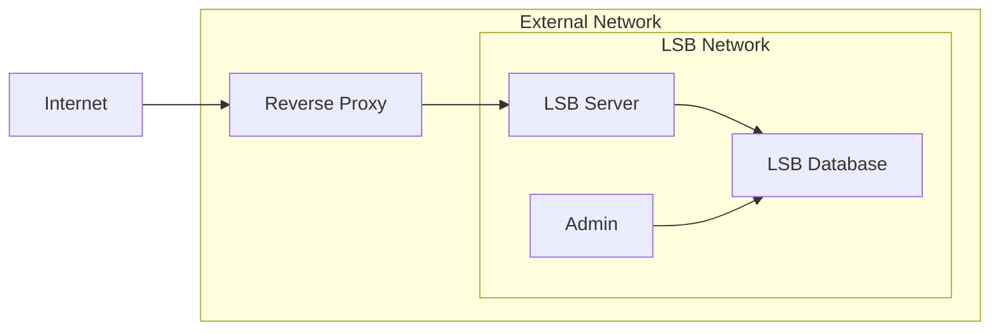

# Docker Support + Examples

## Docker Support in LSB

This article is for those that want to use Docker as part of their workflow, to share some working example files here that anyone can drop into their LSB server project and run. See [the README](https://github.com/LandSandBoat/server/tree/base/docker) for official Docker support.

## No GitHub Issues + Support

Since these examples are provided without warranty or support, and may not be maintainable depending on who's currently around, please do not raise any new GitHub issues if they aren't working. Feel free to submit a PR to the wiki if you have a fix, but otherwise it's on the user to make do. And we'll try and periodically review and update them if possible.

## Docker Example Goals

The goal of the provided files was as follows:

- Create a Dockerfile + docker-compose YAML that would allow one-click starting of the server and dependencies with default values.
- Ensure the server was reachable on the users LAN through a reverse proxy to allow running the server and FFXI on separate machines if desired.
- Provide an SQL admin (adminer) container for easy administration of the database on the same host.

## Docker Example Caveats

The caveats of the provided examples are:

- The configuration provided are defaults for local development and **should not be used for a production deployment**.

## Docker Architecture

We use a reverse proxy in this example, and split traffic between external and internal docker networks for two reasons:

- So that we can access our docker-compose stack from other machines on the network.
- So that external traffic can only talk to what we want it to, and can't try and access our database or admin panel instances directly.

High level it looks something like this:


```mermaid
flowchart LR
 subgraph EXT[External Network]
  direction LR
  subgraph LSB[LSB Network]
   direction TB
   S[LSB Server] --> D[LSB Database]
      A[Admin] --> D
  end
  RP[Reverse Proxy] --> S
 end
 I[Internet] --> RP
```

## docker-compose.yml

```yml
x-dbcreds: &dbcreds
  # MARIADB_ROOT_PASSWORD required if setting up fresh database.
  # Or generate a random root password and print it to build log:
  # MARIADB_RANDOM_ROOT_PASSWORD: true
  MARIADB_ROOT_PASSWORD: 'root'
  MARIADB_DATABASE: xidb
  MARIADB_USER: xiadmin
  MARIADB_PASSWORD: 'password'

x-common: &common
  image: ghcr.io/landsandboat/server:latest
  environment:
    <<: *dbcreds
    XI_NETWORK_HTTP_HOST: 0.0.0.0
    XI_NETWORK_ZMQ_IP: world
    XI_NETWORK_SQL_HOST: database
    XI_NETWORK_ZONE_IP: 192.168.11.11 # UPDATE THIS TO THE LAN IP OF THE HOST MACHINE
    # XI_{file}_{setting}: value
  volumes:
    - losmeshes:/server/losmeshes
    - navmeshes:/server/navmeshes
    # - ./config.yaml:/server/tools/config.yaml
    # - ./map.lua:/server/settings/map.lua
    # - ./modules:/server/modules
  networks:
    - lsb
  labels:
    - "traefik.enable=true"
    - "traefik.udp.routers.game.service=svc_game"
    - "traefik.udp.services.svc_game.loadbalancer.server.port=54230"
    - "traefik.tcp.routers.connect.rule=HostSNI(`*`)"
    - "traefik.tcp.routers.connect.entrypoints=connect"
    - "traefik.tcp.routers.connect.service=svc_connect"
    - "traefik.tcp.services.svc_connect.loadbalancer.server.port=54230"
    - "traefik.tcp.routers.connect1.rule=HostSNI(`*`)"
    - "traefik.tcp.routers.connect1.entrypoints=connect1"
    - "traefik.tcp.routers.connect1.service=svc_connect1"
    - "traefik.tcp.services.svc_connect1.loadbalancer.server.port=54231"
    - "traefik.tcp.routers.connect2.rule=HostSNI(`*`)"
    - "traefik.tcp.routers.connect2.entrypoints=connect2"
    - "traefik.tcp.routers.connect2.service=svc_connect2"
    - "traefik.tcp.services.svc_connect2.loadbalancer.server.port=54001"
    - "traefik.tcp.routers.search.rule=HostSNI(`*`)"
    - "traefik.tcp.routers.search.entrypoints=search"
    - "traefik.tcp.routers.search.service=svc_search"
    - "traefik.tcp.services.svc_search.loadbalancer.server.port=54002"


services:
  # Ease of access tool for the DB, you can type in localhost:8080 to get a web interface to the DB. You can log in with root:wheel
  db_admin_portal:
    image: adminer
    restart: always
    depends_on:
      - database
    networks:
      - lsb
    ports:
      - 8080:8080

  traefik:
    image: traefik
    restart: unless-stopped
    environment:
      TRAEFIK_API_DASHBOARD: false
      TRAEFIK_API_INSECURE: true
      TRAEFIK_ENTRYPOINTS_GAME: true
      TRAEFIK_ENTRYPOINTS_GAME_ADDRESS: ":54230/udp"
      TRAEFIK_ENTRYPOINTS_CONNECT: true
      TRAEFIK_ENTRYPOINTS_CONNECT_ADDRESS: ":54230/tcp"
      TRAEFIK_ENTRYPOINTS_CONNECT1: true
      TRAEFIK_ENTRYPOINTS_CONNECT1_ADDRESS: ":54231/tcp"
      TRAEFIK_ENTRYPOINTS_CONNECT2: true
      TRAEFIK_ENTRYPOINTS_CONNECT2_ADDRESS: ":54001/tcp"
      TRAEFIK_ENTRYPOINTS_SEARCH: true
      TRAEFIK_ENTRYPOINTS_SEARCH_ADDRESS: ":54002/tcp"
      TRAEFIK_PROVIDERS_DOCKER: true
      TRAEFIK_PROVIDERS_DOCKER_WATCH: true
      TRAEFIK_PROVIDERS_DOCKER_NETWORK: "web"
      TRAEFIK_PROVIDERS_DOCKER_EXPOSEDBYDEFAULT: false
    ports:
      - "54231:54231/tcp"
      - "54230:54230/tcp"
      - "54230:54230/udp"
      - "54001:54001/tcp"
      - "54002:54002/tcp"
    volumes:
      - "/var/run/docker.sock:/var/run/docker.sock:ro"
    networks:
      - web
      - lsb

  database:
    image: mariadb:lts
    restart: always
    command: ['--character-set-server=utf8mb4', '--collation-server=utf8mb4_general_ci']
    environment:
      <<: *dbcreds
    volumes:
      - database:/var/lib/mysql
    networks:
      - lsb
    healthcheck:
      test: ["CMD", "healthcheck.sh", "--connect", "--innodb_initialized"]
      start_period: 10s
      interval: 10s
      timeout: 5s
      retries: 3

  database-update:
    <<: *common
    command: ["python", "/server/tools/dbtool.py", "update"]
    depends_on:
      database:
        condition: service_healthy
      traefik:
        condition: service_healthy

  connect:
    <<: *common
    command: ["/server/xi_connect"]
    restart: unless-stopped
    ports:
      - "54001:54001"
      - "54230:54230"
      - "54231:54231"
    depends_on:
      database:
        condition: service_healthy
        restart: true
      database-update:
        condition: service_completed_successfully

  search:
    <<: *common
    command: ["/server/xi_search"]
    restart: unless-stopped
    ports:
      - "54002:54002"
    depends_on:
      database:
        condition: service_healthy
        restart: true
      database-update:
        condition: service_completed_successfully

  world:
    <<: *common
    command: ["/server/xi_world"]
    restart: unless-stopped
    ports:
      - "8088:8088"
    depends_on:
      database:
        condition: service_healthy
        restart: true
      database-update:
        condition: service_completed_successfully

  map:
    <<: *common
    command: ["/server/xi_map"]
    restart: unless-stopped
    ports:
      - "54230:54230/udp"
    depends_on:
      database:
        condition: service_healthy
        restart: true
      database-update:
        condition: service_completed_successfully
      world:
        condition: service_started

networks:
  lsb:
    external: false
  web:
    external: true

volumes:
  database:
  losmeshes:
    external: true
  navmeshes:
    external: true
```
