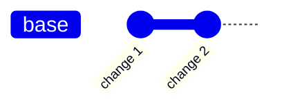
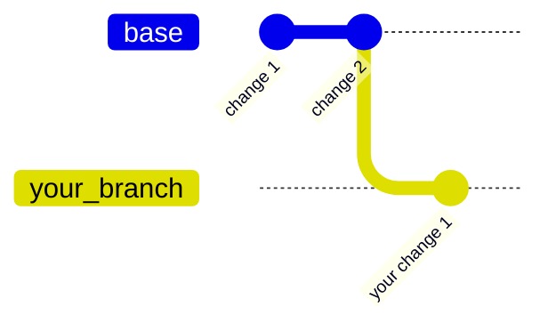
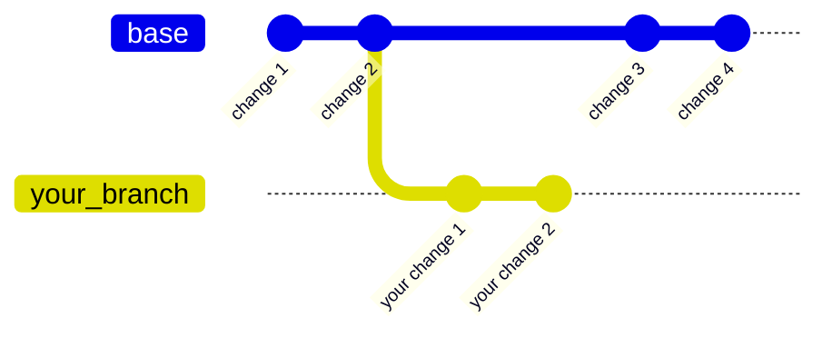
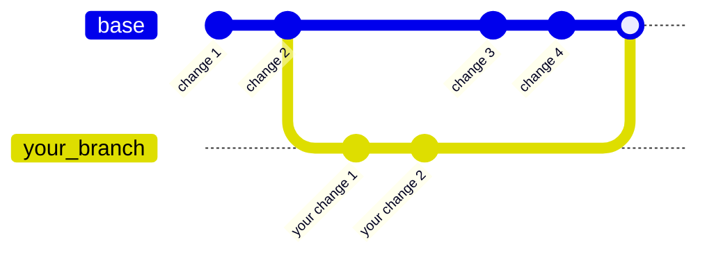
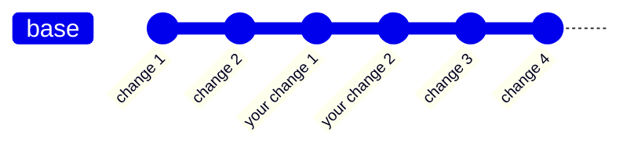

# Git, GitHub, and Contributing

In order to contribute code to LandSandBoat, you'll need to use `git` and `GitHub`. There are many ways to set this up for a smooth experience, we'll go over a few of them now.

## What is git?

```txt
Git is a free and open source distributed version control system designed to handle everything from small to very large projects with speed and efficiency.
```

### Commits

A `commit` is a logical chunk of work. It can be as small as a one-line change, or encompass thousands of lines across hundreds of files. A commit is made up of a description, the attached work, and a bunch of metadata about the author, the time of creation etc.



### Branches



Work continues in `base` and `your_branch`



### Merges



After the merge, your commits will be a part of the main tree



## Basic Branch/Pull Request Information

If you followed the Server Setup instructions, you've already cloned LSB's default branch (called `base`). If you want to make changes and contribute to LSB, here's a quick guide on how to push changes.

### 1 - Set up your fork on GitHub if you haven't already

This is where you'll push changes to then submit a pull request. You can click on [the fork button in the upper-right, above the main `LandSandBoat/server` repository to fork](https://raw.githubusercontent.com/wiki/LandSandBoat/server/images/github-fork.png).

### 2 - Make a new branch from your copy of `base` for _any_ changes

Do **NOT** make your changes directly on `base`. Even if you _don't_ plan on making Pull Requests, make a new branch for your personal changes - this lets you easily update your copy of LSB's `base` branch and merge it into your personal branch. **Making changes on `base` will prevent you from making different changes until the Pull Request you've opened is reviewed and incorporated.**

You can make a branch for anything, but typically it's for a unit of work, which could be something as overarching as SQL edits for all mobs, something more project focused like a single BCNM, or fixing a single bug.

Open your preferred Git client, select `base`, and choose "make branch" (your exact process may vary depending on your Git client). Choose a name for the branch. Select this new branch and "checkout" it to switch to that branch.

If you've made any changes at this point, you'll get an error and be forced to "commit" or "stash" your changes. Commit means bundling the changes you have made on your local machine compared against the branch's original state - a "hard" save. Stash is a temporary "soft" save which lets you change branches and restore that work when you come back.

### 3 - In the new, checked out branch, make the changes as needed

When you've tested and are comfortable with the work, open your Git client and choose to Commit your changes to the branch. In the window that appears, make sure any changes that you don't _intend_ to change on LSB (ex: customized settings or scripts that you don't want merged into LSB) are not included in your commit. You can choose to "Push" from here to send the changes from your local copy to your remote repository.

### 4 - In your remote repository, make sure you're on your new branch which you're looking to contribute from and select New Pull Request

Fill out the relevant checkboxes, put in an appropriate title, etc.

### 5 - Upon review and you making any requested changes, your Pull Request will be merged

with LSB's `base` branch, or a new branch if it's large enough or changed something which warrants further testing before final merge into `base`. All new "side" branches LSB creates in this manner are merged into LSB's `base` branch for ease of testing, or for servers that want to try out cutting-edge features.

**NOTE:** For custom servers, it's probably best to have a separate repository entirely for your server versus your local copy of LSB's vanilla (`base`) build. That way you can clone/download/branch/edit/commit for contributions to LSB without interfering with files in use by your server.

## Keeping Current With LSB

You'll want to consistently update your local copy of LSB's `base` branch with recent changes submitted by contributors. This is part of why working on branches when you have WIPs is important. In order to update both your local and remote `base`:

1. Ensure you're on your `base` branch and have no other local branches checked out
2. Choose "Pull" from the menu of whichever Git tool you're using
3. Select the LSB remote branch to pull in updates from. Remember LSB's default branch is `base`. If you haven't pulled from LSB in a while, you'll want to do a "Fetch" first to update the remote listings in your Git tool.
4. Pull from LSB's remote `base` into your local `base` copy.
5. You'll now need to update your remote repository using the "Push" command. This updates your remote copy to reflect the new updates you just pulled locally.

## Submitting to Multiple Repositories

[You can use git rebase](https://github.com/edx/edx-platform/wiki/How-to-Rebase-a-Pull-Request) to send commits from other locations to LSB in order to submit to multiple locations and/or repoint.

Alternatively, pull a fork of LSB and copy **changes only** manually.

## Authoring

Everyone likes to be credited for their work. Nobody likes to have someone else claim the credit for their work (knowingly or not). For this reason, we think you should be actively trying to attribute commits to other people where relevant.

Projects come and go, patch notes will be lost over time, but the git history is forever!

You can attribute in multiple ways:

### Full Author

If you are fully taking someone else's work, and modifying it to fit your needs, you should do this as two commits:

1: Take the work as-is

2: Modify it to your needs

For commit number 1, you should commit it with: `git commit -m "Commit message" --author "Author Name <authoremail@gmail.com>"`

In this case, you will be the committer, and they will be the author.

### Co-Author

If you have been working closely with someone, and need to credit them (or you're referencing their work), you can add their information as a co-author in your commit message:

```txt
Commit title

Commit body

Co-authored-by: name <additional-dev-1@example.com>
Co-authored-by: name <additional-dev-2@example.com>
```

## Workflow

### Amend

If you have missed something and need to add it to the end of your PR, instead of making an entirely new commit such as "Fixing typo", you do the following:

1) Make the change
2) Stage the change with `git add path/to/changed/file.lua`
3) `git commit --amend`
4) Depending on your setup, an editor should pop up allowing you to edit the commit message. You often don't need to make any changes here so you can exit. If it's `vim` you can type `:q` to exit.
5) (if pushing to a remote branch) `git push --force`

### Rebase

### Reference

<https://stackoverflow.com/questions/7442112/how-to-attribute-a-single-commit-to-multiple-developers>

```sh
# Number of commits per author since date
git shortlog -s --since="01 Jan 2021"

# Contribution statistics since "1 year ago"
git log --shortstat --since "1 year ago" | grep "files changed" | awk '{files+=$1; inserted+=$4; deleted+=$6} END {print "files changed", files, "lines inserted:", inserted, "lines deleted:", deleted}'

# Count commits since date
git rev-list --count --after="Jan 1 2021" --all --no-merges
```
